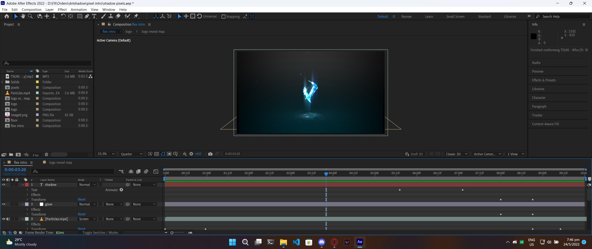

# Sections

## My CCA is split into 3 sections

Participating in different competitions:

### Lego

This section builds Lego robots to compete in a mission that changes annually. This competition is known as NRC (National Robotics Competition) Everyone is part of this section and everyone has to participate in this competition every year.

The mission for this competition changes every year, and each year has a unique team. For example, this year's theme is Search and Rescue.

.png>)

Participants have to programme the robot they built to complete the mission to score points, within a time limit. This competition is completely autonomous.

View my LEGO Bot here.

_When members of the Robotics CCA graduate from Sec 1, they are required to pick a section they would like to join for the next 3 years in the CCA. The 2 sections are_ [_VEX_](sections.md#undefined) _and_ [_RoboCup_](sections.md#robocup)_._

### VEX

Similar to NRC, this competition's mission and theme change every year. However, instead of small plastic robotics, VEX builds robotics made of aluminium, and steel, combined with motors and pneumatics (gas pistons and air tanks), making this section a lot more technical.

 (1).png>)

The robots are also pretty big, usually the size of 0.5m x 0.5m

VEX competitions have both an autonomous and driver control segment.

### RoboCup

RoboCup is the section that I specialise in, specifically RoboCup Lightweight

In this section, we build completely autonomous robots that play soccer/football against each other.

RoboCup competitions require us to design our robots from scratch, as it does not have premade parts like [LEGO ](sections.md#lego)and [VEX](sections.md#vex). We have to design our 3D parts and 3D print them (Mechanical Design). We also have to design our own circuit boards, send them for printing and purchase electrical components to solder onto our circuit boards.

We then have to program and code our robot, integrating algorithms for robot positioning, ball detection etc.

I enjoy being part of this section as I can learn many useful [skills and techniques](skills-i-picked-up.md) that are definitely useful in the future.

View my RoboCup Bot here.
