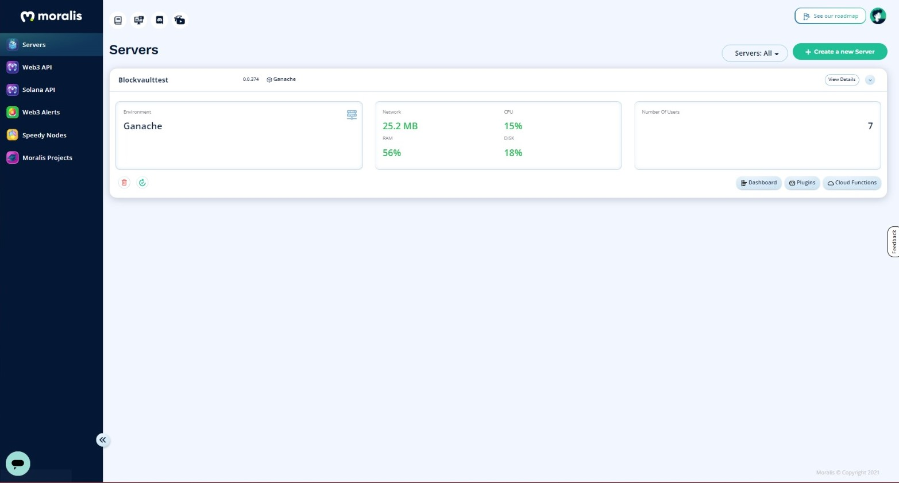

# Things I Can Learn

## User interface & experience design (UIUX Design)

UIUX Design refers to the creation and optimisation of a user interface in order to achieve the best and smoothest user experience. I get to learn how to use prototyping tools like [Figma](../student-initiated-learning/graphic-design.md#figma).

This preview below is made completely from scratch using Figma. It is used as a prototype or preview of the actual webpage for our project work final product.

.png>)

## Web development

This refers to the building of websites using code, which is an incredibly useful skill. Even this portfolio you are viewing right now is built this way.

For our current progress, the actual webpage is already in development.

.png>)

## Back-end development (involving crypto.)

For my project, our group is making use of development tools like Moralis and Ganache. Just think of it as tools made for developers working with cryptocurrency and the Blockchain network.

## Other useful skills

### Working with my team

Teamwork is very important for such a project to be a success, so my team has managed to spilt the work among our group members. The workload is split into 3 parts: UIUX Design, Web Design and Back-end design with members allocated to each section.

I was allocated to UIUX Design as I had experience in [graphic design](../student-initiated-learning/graphic-design.md)

### Research

I believe that having the ability to Google and research for information and tutorials is very important. This year, we aim to not depend too much on our mentor. What we are focusing on for this project is not taught in the computing curriculum. Thus, independent learning is incredibly important.

## Experience so far

So far, it has been fun and engaging to be part of this project. I have already learnt many new skills and I look forward to completing the project.
