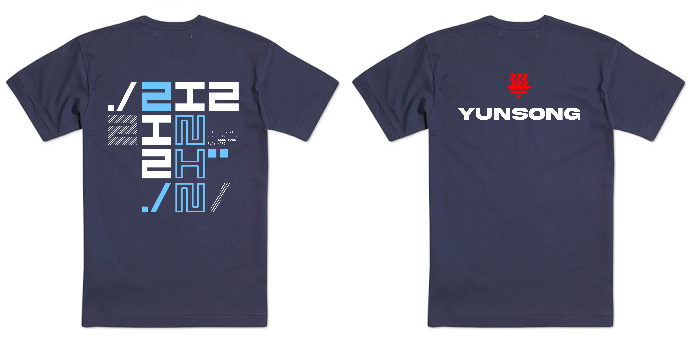
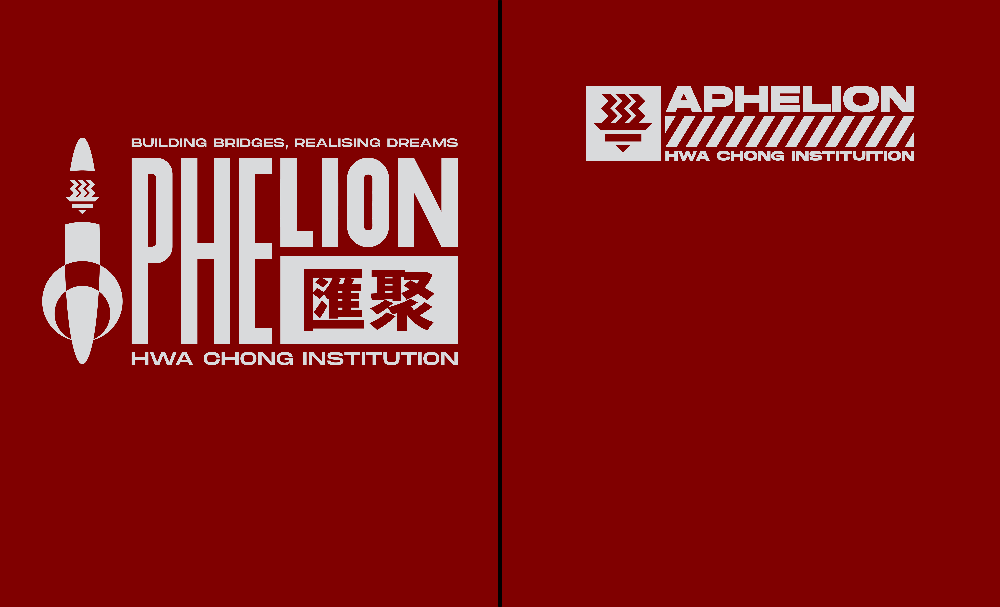

# Graphic Design

## What is graphic design?

> Graphic design is the profession and academic discipline whose activity consists in projecting visual communications intended to transmit specific messages to social groups, with specific objectives.

## How did I start?

I got into graphic design when I was in Secondary 1, when I was designing a thumbnail for my friend. When I searched for tutorials on how to do it, I was awed by all the beautiful designs others could do and was eager to learn how to make something similar.

I started by learning how to use Adobe Photoshop, and I learnt independently by finding tutorials online. I also realised how useful this was for school and in the future. I learnt how to make logos, posters, T-Shirt designs etc.

## Tools I learnt how to use

Keep in mind that everything I've mentioned so far was self-taught using tutorials and research online. Part of learning was also exploring on my own to see what I can make, and this was what I found joy in.

### Adobe Photoshop

Other than Photoshop, I also learnt how to use many other design tools that were a better fit for the result I was trying to achieve.

> Adobe Photoshop is the predominant **photo editing and manipulation software** on the market. Its uses range from the full-featured editing of large batches of photos to creating intricate digital paintings and drawings that mimic those done by hand.


_Fig. 5.1.1: Adobe Photoshop website_


### Adobe Illustrator

Another tool I used was Adobe Illustrator, which was better for drawing logos and flat-coloured shapes.

> Adobe Illustrator is the industry standard design app that lets you **capture your creative vision with shapes, color, effects, and typography**. Work across desktop and mobile devices and quickly create beautiful designs that can go anywhere


_Fig. 5.1.2: Adobe Illustrator website_


### Figma

Lastly, for designing webpages, applications, software and UI (User Interface) prototypes, I learnt how to use Figma.

> Figma is a online collaboration tools that designers and developers use **to build digital products**. Online collaboration tools allow designers and developers to edit, comment, and review designs and code together.


_Fig. 5.1.3: Figma website_


Figma was also particularly useful for my [project work](broken-reference) for making prototypes.

## Benefits of learning graphic design

### In school

Having such a skill enabled me to help my class and even the school design and create things.

#### Class T-Shirts

I have designed multiple T-shirts for my class over the years.

#### Consortium T-Shirts

#### Classwork and assignments

There are many classwork and assignments that require designing a poster, making a graphic etc. When I work in groups with my friends, they usually put me in charge of anything related to designing and it also makes it much easier for me.

#### Helping my friends who are in council

Many of my friends in coucil need help related to graphic design and come to me for help sometimes. I am more than happy to help them as I can gain some experience and recognition for what I love to do as well.

### Earning some money from commissions

Using social media and other various platforms, I have found people who wanted designs and agreed with me helping them. This allows me to earn some pocket money from doing commissions.
