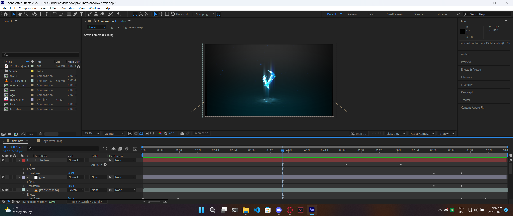

# Video Editing

## How did I start?

I started video editing in Secondary 1, when I was trying to make a YouTube video. Instead of using all the simple video editing tools people normally use like iMove, Kinemaster etc, I wanted to learn how to use more complex video editors to make my videos better.

## Tools I learn to use

I learnt how to use these apps through watching hours of YouTube tutorials and reading video editing forums.

### Adobe Premiere Pro


_Fig. 5.2.1: Adobe Premiere Pro website_


> Premiere Pro is the industry-leading **video editing software for film, TV and the web**.

Premiere Pro is the main video editing tool that I use today, as it is made for professionals and thus is packed with many useful functions and effects.

.png>)

### Adobe After Effects


_Fig. 5.2.3: Adobe After Effects website_


Adobe After Effects is better for visually stunning effects as it has much more presets for effects compared to Premiere Pro

> Adobe After Effects is the industry standard tool for **motion graphics and visual effects**.

## Experiences with video editing in school

### Founder's Day Video Competition 2021

This competition was held to commemorate Hwa Chong turning 102 years old, and participants were supposed to make a montage commerating how far the school has come.


_Fig. 5.2.3: Short clip of Founder's Day Video Competition 2021 submission_


### Class montages in Sec 2

In Sec 2, I helped my class edit a montage of a compilation of all the memories and moments we went through together in Sec 1 & 2.

### Appreciation month skit 2022

Together with my classmates, we had to come up with a skit to show our appreciation towards the non-teaching staff, specifically the school's Financial Department. I used [Premiere Pro](video-editing.md#adobe-premiere-pro) to edit the video.

_any many more ..._
